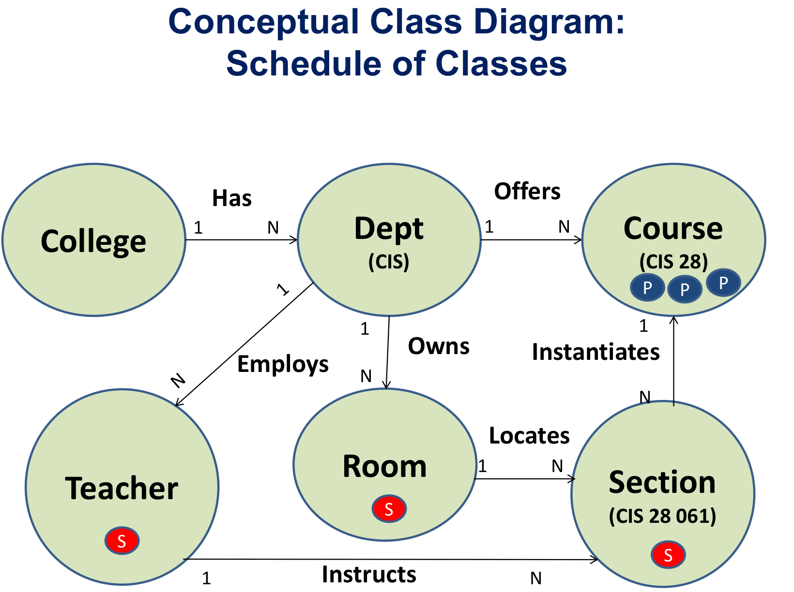

# Conceptual Class Diagram (CCD)




# Section

```
                          // The big 3
ID (String);              // Unique ID of Section (ex: "SECTION-xxx" or just use UUID)
Type (enum);              // Type of Section ("physical"/"virtual")
State (enum);             // State of Section ("open"/"waitlist"/"full")
 

                          // The connections to other classes (from the CCD)
Seats (Collection);       // A Section has a list of seats connecting to Students (1:n)
Teacher (Teacher Ptr);    // A Section has a teacher (1:1)
Course (Course Ptr);      // A Section has a course (1:1)
Room (Room Ptr);          // A Section has a room (1:1)


                          // Other stuff that may be necessary – this is where teams should brainstorm
CRN (Integer);            // Course Registration Number (ex: 28736)
Name (String);            // Name (ex: "Computer Info Systems - S01")
Description (String);     // Description of Section
Campus (String);          // Campus of Section (ex: "FH", "FW", "FO", "DA", "DW", "DO")
Period (String);          // Period of Section (ex: "09/23/2024 - 12/09/2024")
Credit (Float);           // Credit of Section (ex: 5.0, 2.5)
Schedule (Object);        // When the Section is open
Material (String);        // Material used in Section (ex: textbooks, resources)
```


# Department attribute list for reference

```
                                   // The big 3 – make sure you include them
Abbreviation (String);             // Unique ID of Department (ex: "CIS")
Type (enum);                       // Type of Department (probably not needed:  maybe "degree granting / non-degree")
State (enum)                       // State of Department (probably not needed:  maybe “underfunded / solvent”)
 
                                   // The connections to other classes (from the CCD)
Division (Object Ptr);             // A Department points to the College or its owning Division (n:1)
                                   // [CIS Department points to Business Division]
Teachers (Collection);             // A Department has a list of qualified Teaching Employees (1:n)
Courses (Collection);              // A Department offers a selection of courses (1:n)
Rooms (Collection);                // A Department has a list of rooms it owns (1:n)
Students (Collection)              // Students may “major” in a specific department (1:n)
 

                                   // Other stuff that may be necessary – this is where teams should brainstorm
Name (String)                      // Name (ex: Computer Info Systems)
Description (String);              // Description of Department
Village (Village Ptr)              // Village Department belongs to  [Not a string]
Dean (Manager  Ptr)                // Department Dean  (n:1) - Managerial Employee
                                   // [All Department in a Division have the same Dean]
Secretary (Classified Ptr);        // Department Secretary (1:1) - Classified Employee
Chair (Teacher Ptr);               // Department Chair (1:1) - Teaching Employee
Location (Room Ptr);               // The location of the department office
PhoneNumber (String)               // Department phone #
Schedule (Object);                 // When the department office is open
Certificates (Object Collection);  // List of special departmental programs (1:n)
Events (Object Collection);        // List of department events (1:n)
```
