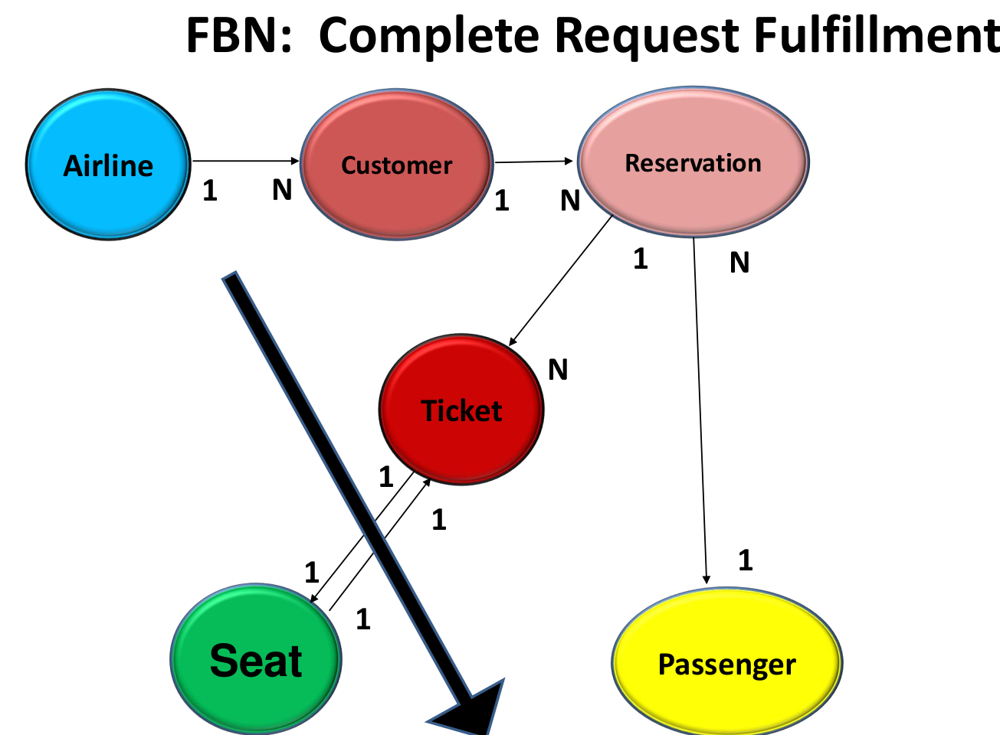
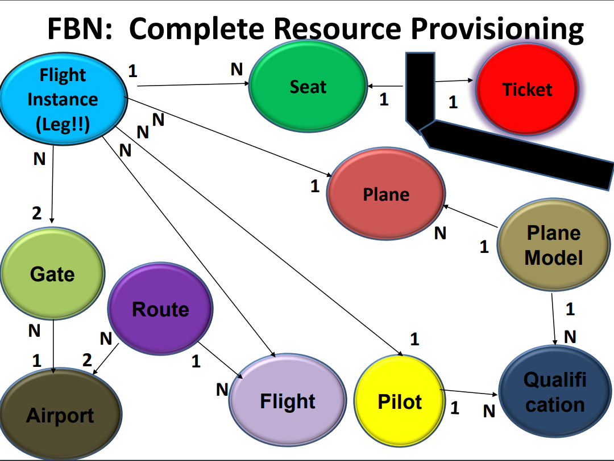

# Part 0 - CCD

## Complete Request Fulfilment



## Complete Resource Provisioning



# Part 1 - Vocabulary

## Candidates for the associated object

```
(C) Class – Basic application abstraction (like “Teacher” is a Class)
(SC) Subclass – is a subclass of a more general class (like “PartTime” is a subclass of Teacher)
(CC) Collection Class – Collects a specified class of objects (like “Faculty” is a Dept. collection class of
Teacher)
(OO) Object of – Not a class at all, but an object of a class (like “De Anza” is an object of the College class)
(E) Event – is an event (function or method) of a class (like “Enroll” is an event of Student)
(A) Attribute – is an attribute of a class (like “GPA” is an attribute of Student)
(TV) Type Value – is a possible “type” of a class (like “Foreign” is a type of Student)
(SV) State Value – is a possible state of a class (like “Full” is a state of a Section)
(ID) Unique ID – Uniquely identifies a specific object (like “StudentNum” identifies a specific Student)
(NR) Not Required – may be duplicate of another abstraction or simply not make sense
```

## "things" ⇔ associated object
| things            | associated object |
| ----------------- | ----------------- |
| Airport           | (C) |
| ArrivingAirport   | (A) of a Route class  |
| Boeing747         | (TV) of a PlaneModel  |
| Gate              | (C) |
| AssignedGate      | (A) of a FlightInstance  |
| BagTag            | (A) of a Seat  |
| BarCode           | (A) of a Seat  |
| CheckIn           | (E) of a Ticket  |
| CheckedIn         | (A) of a Ticket  |
| Plane             | (C)  |
| Model             | (C)  |
| OnTime            | (SV) of a FlightInstance  |
| ScheduledTA       | (A) of a Flight  |
| EstimatedTA       | (A) of a Flight  |
| ActualTA          | (A) of a FlightInstance  |
| Reservation       | (C)  |
| BusinessClass     | (TV) of a Seat |
| RoundTrip         | (A) of a Reservation  |
| FrequentFlyer     | (A) of a Passenger  |
| Flight            | (C)  |
| FlightInstance    | (C)  |
| Weather           | (A) of a Airport  |
| TSA #             | (A) of a Ticket  |
| Hijacker          | (NR)  |
| MaxRange          | (A) of a Plane Model |
| MilesTillEmpty    | (A) of a FlightInstance  |
| Meal              | (A) of a Seat  |
| SeatChart         | (A) of a Plane |
| SeatMap           | (A) of a Plane Model |
| Receipt           | (A) of a Reservation  |
| Price             | (A) of a Ticket  |
| SFO               | (OO) of a Airport  |
| CoPilot           | (SC) of Pilot  |
| Delayed           | (SV) of a FlightInstance  |
| Luggage           | (A) of a Seat  |
| Tag               | (A) of a Ticket  |


# Part 2 - Attribute Lists

## Plane

```
                             // The Big 3
ID (String);                 // Unique identifier for the plane
Type (enum);                 // Type of Plane (e.g., "Commercial", "Cargo", "PrivateJet", "Military")
State (enum);                // Current status of Plane (e.g., "Operational," "Maintenance," "Grounded," "Retired", "Missing")

                                      // Connections to other classes (from the CCD)
SeatMap (Object);                     // Layout showing the arrangement of seats.
PlaneModel (PlaneModel Ptr);          // Reference to PlaneModel.
FlightInstance (FlightInstance Ptr);  // Reference to the associated FlightInstance.


                             // Other stuff that may be necessary
Manufacturer (String);       // Company that manufactured the plane.
Capacity (Integer);          // Maximum number of passengers.
CrewCapacity (Integer);      // Number of crew members the plane can accommodate.
MaxLuggageWeight (Float);    // Maximum luggage weight the plane can safely carry, in kilograms or pounds.
Range (Float);               // Maximum flying range in nautical mile.
FuelType (enum);             // Type of fuel used (e.g., "Jet A1", "Jet A", "JP-8", "Biofuel", "Hydrogen", "Electric").
Owner (String);              // The company or individual owning the plane.
Age (Integer);               // Number of years since manufacture.
LastMaintenanceDate (Date);  // Date when last serviced.
RegistrationNumber (String); // Official registration identifier.
BaseLocation (String);       // Primary stationed airport.
CurrentLocation (String);    // Current stationed airport.
```

## Flight Instance

```
                             // The Big 3
ID (String);                 // Unique identifier for the flight instance.
Type (enum);                 // Type of Flight (e.g., "Scheduled," "Charter").
State (enum);                // Current status of Flight (e.g., "Scheduled", "In Progress")

                             // The connections to other classes (from the CCD)
Plane (Plane Ptr);           // Reference to the associated Plane.
Pilot (Pilot Ptr);           // Reference to the Pilot assigned.
CoPilot (Pilot Ptr);         // Reference to the CoPilot assigned.
Route (Route Ptr);           // Reference to the associated Route.
AssignedGate (Collection);   // Collection to Gate Ptr.
SeatChart (Collection);      // Dynamic Seat statuses for this flight.
SeatStatus (Collection);     // Decoupled Seat availability and conditions.
CrewList (Collection);       // List of assigned crew members.


                                      // Other stuff that may be necessary
Status (enum);                        // Punctuality status (e.g., "On-Time", "Delayed", "Canceled", "Early", "Diverted", "Landed")
FlightNumber (String);                // The designated flight number.
DepartureAirport (String);            // Airport code for departure.
ArrivalAirport (String);              // Airport code for arrival.
ScheduledDepartureTime (DateTime);    // Planned departure time.
ScheduledArrivalTime (DateTime);      // Planned arrival time.
ActualDepartureTime (DateTime);       // Actual departure time.
ActualArrivalTime (DateTime);         // Actual arrival time.
MilesTillEmpty (Float);               // Estimated remaining miles.
Airline (String);                     // Operating airline.
PassengerCount (Integer);             // Number of passengers.
LuggageWeight (Float);                // Luggage weight of the flight instance, in kilograms or pounds.
DepartureWeatherConditions (String);  // Weather at departure.
ArrivalWeatherConditions (String);    // Weather at arrival.
```
