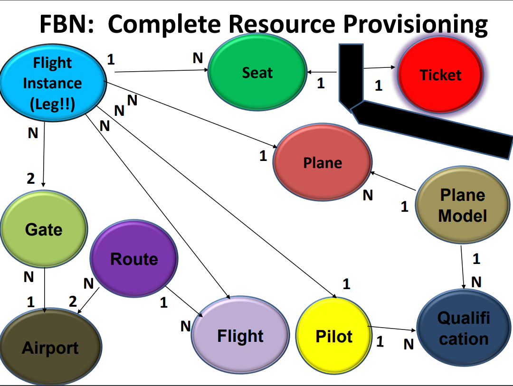

# Part 1 - Vocabulary

## Candidates for the associated object

```
(C) Class – Basic application abstraction (like “Teacher” is a Class)
(SC) Subclass – is a subclass of a more general class (like “PartTime” is a subclass of Teacher)
(CC) Collection Class – Collects a specified class of objects (like “Faculty” is a Dept. collection class of
Teacher)
(OO) Object of – Not a class at all, but an object of a class (like “De Anza” is an object of the College class)
(E) Event – is an event (function or method) of a class (like “Enroll” is an event of Student)
(A) Attribute– is an attribute of a class (like “GPA” is an attribute of Student)
(TV) Type Value – is a possible “type” of a class (like “Foreign” is a type of Student)
(SV) State Value – is a possible state of a class (like “Full” is a state of a Section)
(ID) Unique ID – Uniquely identifies a specific object (like “StudentNum” identifies a specific Student)
(NR) Not Required – may be duplicate of another abstraction or simply not make sense
```

## "things" <-> associated object
| things            | associated object |
| ----------------- | ----------------- |
| Airport           |   |
| ArrivingAirport   |   |
| Boeing747         |   |
| Gate              |   |
| AssignedGate      |   |
| BagTag            |   |
| BarCode           |   |
| CheckIn           |   |
| CheckedIn         |   |
| Plane             |   |
| Model             |   |
| OnTime            |   |
| ScheduledTA       |   |
| EstimatedTA       |   |
| ActualTA          |   |
| Reservation       |   |
| BusinessClass     |   |
| RoundTrip         |   |
| FrequentFlyer     |   |
| Flight            |   |
| FlightInstance    |   |
| Weather           |   |
| TSA #             |   |
| Hijacker          | (NR)  |
| MaxRange          |   |
| MilesTillEmpty    |   |
| Meal              |   |
| SeatChart         |   |
| SeatMap           |   |
| Receipt           |   |
| Price             |   |
| SFO               |   |
| CoPilot           |   |
| Delayed           |   |
| Luggage           |   |
| Tag               |   |


# Part 2 - Attribute Lists

## CCD



## Plane

```
                             // The big 3
ID (String);                 // Unique ID of Plane ()
Type (enum);                 // Type of Plane ("xxx"/"xxx")
State (enum);                // State of Plane ("xxx"/"xxx")

                             // The connections to other classes (from the CCD)


                             // Other stuff that may be necessary
```

## Flight Instance

```
                             // The big 3
ID (String);                 // Unique ID of Flight ()
Type (enum);                 // Type of Flight ("xxx"/"xxx")
State (enum);                // State of Flight ("xxx"/"xxx")

                             // The connections to other classes (from the CCD)


                             // Other stuff that may be necessary
```
